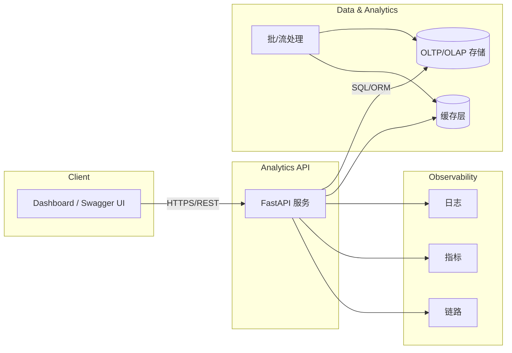

# 架构设计

本仓库提供一个轻量演示服务与文档，可扩展为生产级“借阅分析系统”。系统分层如下：

## 关键组件
- **FastAPI 服务**：暴露指标查询、分馆/用户维度统计与健康检查；可扩展为多进程/容器部署。
- **数据存储**：演示版使用 JSON/内存；生产可替换为 PostgreSQL + Timescale/ClickHouse；推荐为分析面准备专门的宽表或物化视图。
- **处理层**：批处理（每日 ETL）或流处理（基于 Kafka/Fluent Bit 收集借阅事件，Flink/Spark 作聚合），产出到分析存储。
- **缓存层**：Redis/Memcached 加速热点查询（热门图书/分馆负载）。
- **可观测性**：OpenTelemetry 采集日志、指标和 traces，支持 SLO/报警。

## 数据流
1. 借阅事件通过 API、消息队列或日志采集进入摄取层。
2. ETL/流处理标准化事件，补全用户/图书维度，写入分析存储与缓存。
3. API 从缓存或分析存储读取指标，聚合后返回给仪表盘或外部调用方。
4. 监控组件记录请求耗时、错误率和数据新鲜度，触发报警。

## 部署与环境
- **本地/演示**：`uvicorn app.main:app --reload` 即可启动，适合快速验证。
- **容器化**：使用多阶段 Docker 构建（基于 python-slim），运行时仅保留应用与依赖；暴露 8000 端口；通过环境变量配置数据源连接与缓存参数。
- **伸缩**：前置 Nginx/ingress，Kubernetes HPA 根据 CPU/自定义指标（如 p95 latency）自动扩缩容；可在 Job 层独立伸缩以解耦查询与计算。

## 配置要点
- 环境变量示例：
  - `APP_ENV`（dev/prod）
  - `DATA_SOURCE_URL`（PostgreSQL/ClickHouse）
  - `CACHE_URL`（Redis）
  - `ALLOWED_ORIGINS`（CORS）
- Feature Flags：启用/禁用实验性指标或新 ETL 管线。

## 可靠性设计
- 健康检查：活跃探针 `/health`，就绪探针可增加对数据库/缓存的探活。
- 退化策略：缓存 miss 时可回退到最近的物化视图快照；在存储压力增大时降级高级查询。
- 审计：记录所有写操作与管理动作，确保追溯。
