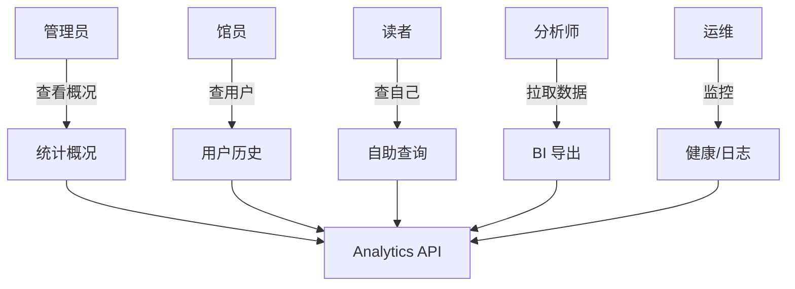
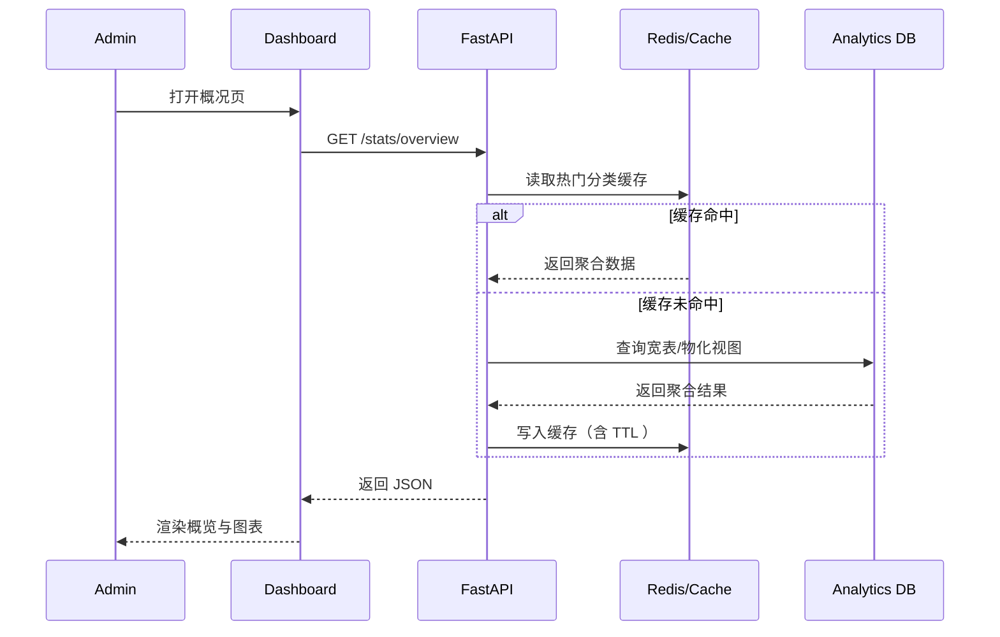
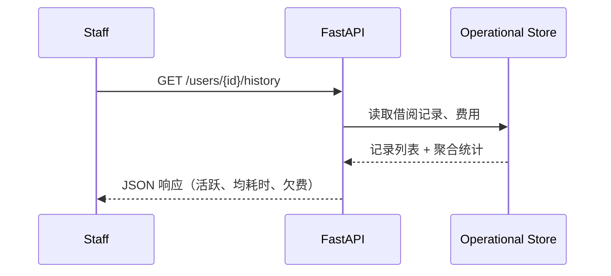

# 用例与时序图

## 核心用例
1. 管理员查看全局借阅概况与分馆负载。
2. 馆员根据用户 ID 查询借阅历史与欠费。
3. 读者查看自己当前/历史借阅，评估还书时间。
4. 分析师导出热门图书、分类趋势，并对接 BI 工具。
5. 运维监控健康状态与错误率。

## 用例图（简化）

```mermaid
flowchart TD
    Admin[管理员]
    Staff[馆员]
    Reader[读者]
    Analyst[分析师]
    Ops[运维]

    Admin -->|查看概况| Overview[统计概况]
    Staff -->|查用户| UserHist[用户历史]
    Reader -->|查自己| SelfHist[自助查询]
    Analyst -->|拉取数据| Exports[BI 导出]
    Ops -->|监控| Health[健康/日志]

    Overview --> API[Analytics API]
    UserHist --> API
    SelfHist --> API
    Exports --> API
    Health --> API
```

## 时序图：管理员查看概况

```mermaid
sequenceDiagram
    participant Admin
    participant UI as Dashboard
    participant API as FastAPI
    participant Cache as Redis/Cache
    participant DB as Analytics DB

    Admin->>UI: 打开概况页
    UI->>API: GET /stats/overview
    API->>Cache: 读取热门分类缓存
    alt 缓存命中
        Cache-->>API: 返回聚合数据
    else 缓存未命中
        API->>DB: 查询宽表/物化视图
        DB-->>API: 返回聚合结果
        API->>Cache: 写入缓存（含 TTL ）
    end
    API-->>UI: 返回 JSON
    UI-->>Admin: 渲染概览与图表
```

## 时序图：馆员查询用户借阅

```mermaid
sequenceDiagram
    participant Staff
    participant API as FastAPI
    participant DB as Operational Store

    Staff->>API: GET /users/{id}/history
    API->>DB: 读取借阅记录、费用
    DB-->>API: 记录列表 + 聚合统计
    API-->>Staff: JSON 响应（活跃、均耗时、欠费）
```
